<p align="center">
  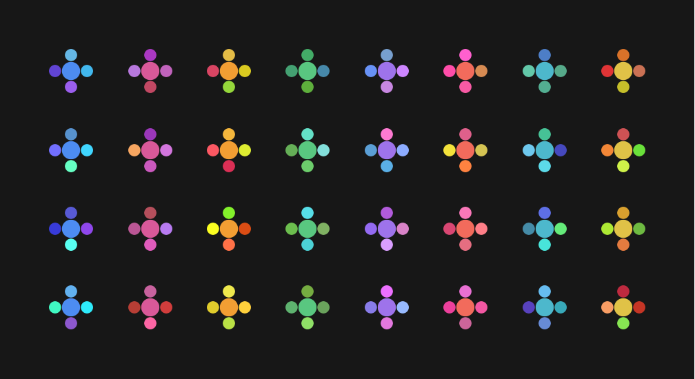
</p>

<h1 align="center">dwell</h1>

<p align="center"><em>one task, under the notch, until it's done.</em></p>

A to-do list shows you everything you are not doing. dwell shows you one thing, in the one
place your eyes already return to a hundred times a day.

It hangs a single iCloud reminder from the MacBook notch and gets out of the way. Click it
for the details, press **done** to complete it in Reminders everywhere, and pick what's next.

Requires **macOS 26 (Tahoe)**. Swift 6, SwiftUI and AppKit, no dependencies.

This repo carries the built app. The source lives at
**[headlesz/dwell](https://github.com/headlesz/dwell)**.

---

## every reminder gets a flower

<p align="center">
  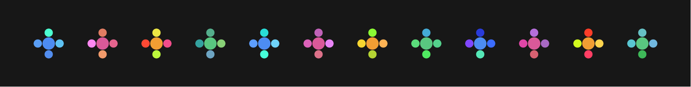
</p>

Five dots. The **centre** is your list's colour — blue for work, orange for home, whatever
you set in Reminders. The **four petals** come from that reminder's own identifier, so two
tasks in the same list share a centre and differ everywhere else.

<p align="center">
  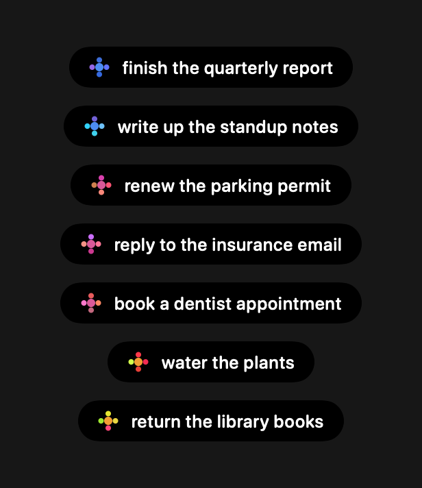
</p>

*finish the quarterly report* and *write up the standup notes* are both blue-centred because
they're both Work — but one wears violet and indigo, the other teal and cyan. Same for the
pink pair and the orange pair. After a day or two you stop reading the pill and start
recognising it.

It's decoration that earns its place by being information, which is what makes the rules
around it strict. **Nothing is stored and nothing is random**: the seed is an FNV-1a hash of
the reminder's identifier, because Swift's own `hashValue` is seeded per process and would
have repainted every reminder on every launch — the exact opposite of identity. Petal hues
stay within about a sixth of the colour wheel of the list's hue, so a reminder reads as
*belonging to its list* rather than looking randomly recoloured.

### it turns

<p align="center">
  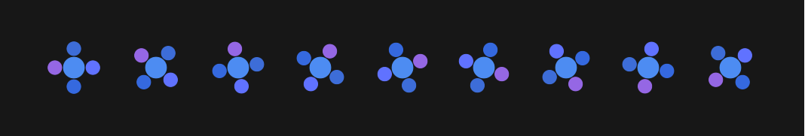
</p>

The petals hold formation and circle the centre once every fourteen seconds. Nine frames
above, one full revolution — track the violet petal.

Four motions were built and compared before this one won. The most *alive* of them scattered
the petals as it moved, and lost anyway: a mark you're meant to recognise has to stay
recognisable.

## the same flower, everywhere

<p align="center">
  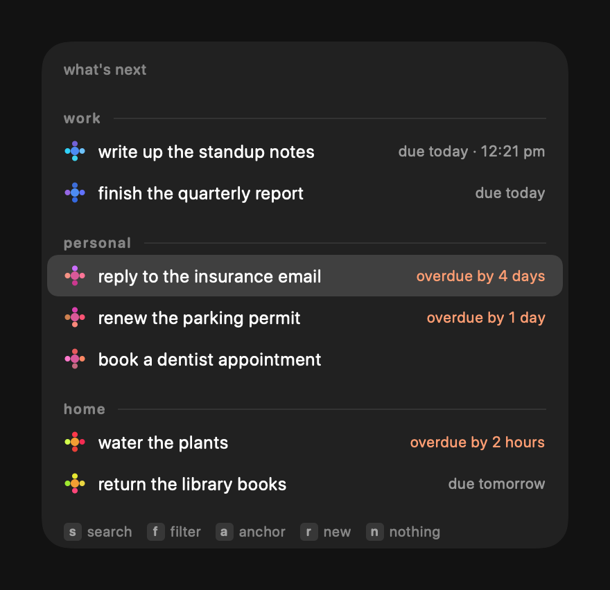
  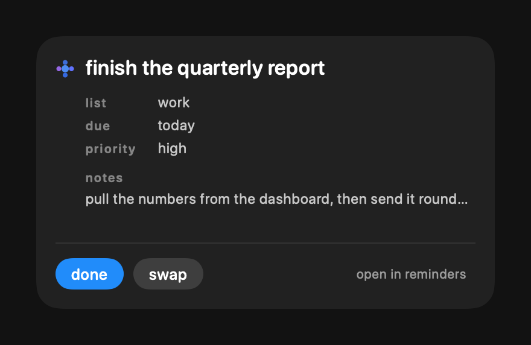
</p>

Pick a new focus and the same flowers are in the list. Open the one you're on and it's there
again. The menu bar icon is one too, tinted by whatever you're dwelling on.

Because the rows carry the colour, the **section headers carry none**. A coloured list name
beside a row of coloured flowers is the same colour shouted twice, a few pixels apart.
Headers are small, tracked out and grey; structure stays grey, content stays light. The
detail panel follows the same rule — field names in the header's voice, values in light
text, and no list-colour dot anywhere, because the flower's centre already is one.

The picker's flowers are still. One turning flower is an accent; twenty is noise.

## finding and capturing

<p align="center">
  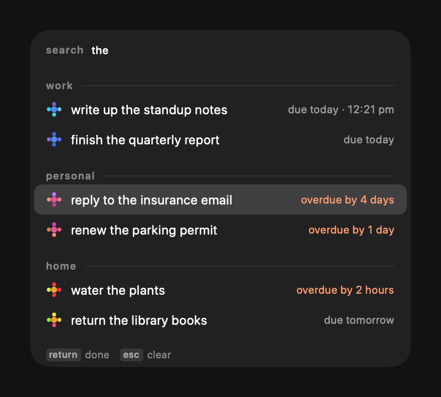
  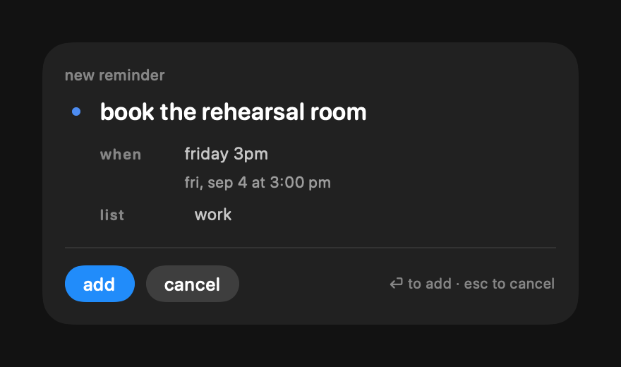
</p>

**`s`** turns the header into a filter and narrows the list as you type. **`return`** ends
the search without picking anything: the filter stays, and the letter keys go back to being
commands, so you can `a`-anchor the thing you just went looking for. Selecting it is a
second `return`. The header tells you which of the two you are in — a cursor while you type,
the query as plain text once it's committed — and the hints along the bottom only ever list
keys that work right now.

**`f`** filters by everything that isn't in the title. It reads a short phrase — `work tdy`,
`home tmrw`, `late hi`, `work tdy 5pm` — and narrows the list by attribute:

| | |
|---|---|
| `tdy` `today` | due today **or already late** |
| `tmrw` `tmw` `tomorrow` | tomorrow only |
| `late` `od` `overdue` | overdue only |
| `mon`…`sun` · `wknd` · `wk` | that day · the next weekend · the next 7 days |
| `someday` `undated` `nodate` | no due date at all |
| `hi` `!` · `med` · `low` | priority |
| `rpt` · `anchored` · `notes` | repeating · pinned to a desktop · has notes |
| `4pm` `5:30pm` `17:00` | a cutoff — *by* that time, not *at* it |
| anything else | a list name |

Unlike the search, a filter **stays on**. It survives picking a focus, the pill collapsing and
the panel reopening, until you press `f` again — which is why the header keeps saying `filter
work tdy` for as long as it's set, and why the hint reads `f filter off` rather than `f
filter`. A list that's short for a reason you can't see is the one thing this had to avoid.
Quitting clears it; nothing else does.

A search then runs *inside* the filter, never beside it. Anything the filter ruled out stays
ruled out.

Words it can't place are called out in the header rather than dropped — `work zzz` shows
nothing and colours the `zzz`, because a typo that silently changed the list would leave you
reading a shorter one with no idea why.

<p align="center">
  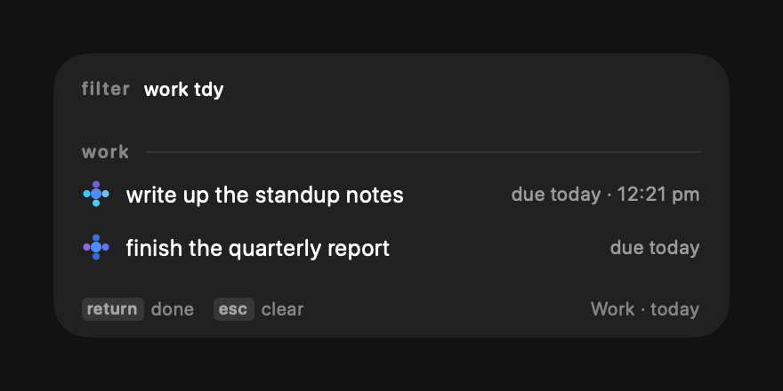
</p>

**`r`** opens a
compose panel without leaving the notch — a title, a due date typed however you'd say it
(*tomorrow*, *friday 3pm*), and a list defaulting to the one you were looking at. The date
field echoes what it understood before you commit, and says so plainly when it understood
nothing.

<p align="center">
  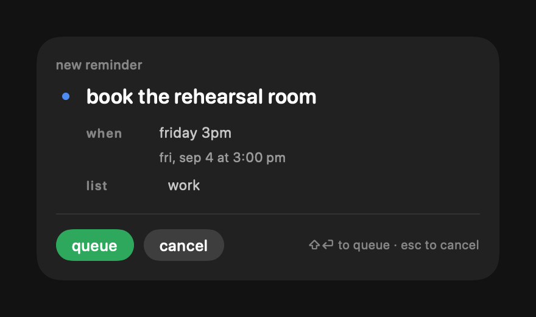
</p>

**Hold shift** and **add** becomes **queue**, in green: the reminder is written but the focus
doesn't move to it, and you land back in the list rather than on the new task. Capturing
something mid-task usually means you are *not* going to do it now — switching to it would
undo the reason you wrote it down — and coming back to the list leaves `r` under your finger
for the next one.

The caption says `⇧⏎ to queue` before you hold anything. Unlike **term**, this layer
advertises itself: the reminder is written either way and only the focus differs, so there is
nothing to protect you from, and a modifier nobody knows about may as well not exist.

## a task per desktop

**`a`** anchors a task to the desktop you're on. Switch Spaces and the pill follows it. A
grey dot means *anchored to this desktop*, so it disappears when a focus carries onto a
desktop it isn't pinned to.

The model is **one roaming focus plus any number of anchored overrides**. Desktops without an
anchor share a single focus between them — what you were last doing out there — so moving
between them doesn't drag along whatever an anchored desktop was showing. That shared focus
can be nothing: press `n` out there and every unanchored desktop stays empty until you
choose again. Anchored desktops
override it entirely.

Anchoring is deliberate in both directions: `a` pins a desktop, and choosing a different task
while you're on it un-pins it again. Anchors are remembered across launches by default;
settings can make them session-only.

This is the one place dwell uses a private API, and not by choice. macOS publishes nothing
for "which desktop is this". The public `com.apple.spaces` preference looks like it knows,
but it tracks desktops being created and reordered, not switched between — verified by
watching it sit unchanged through real switches. So the active desktop comes from a private
CoreGraphics call, resolved at runtime rather than linked, which disables anchoring on any
macOS that stops vending it rather than breaking the app. It also means dwell can't go to the
App Store as-is.

## finishing something

<p align="center">
  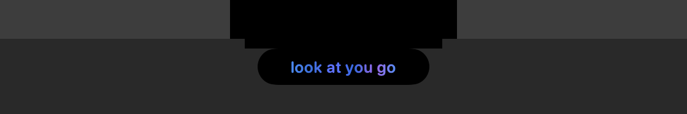
</p>

Press **done** and the reminder completes in Reminders on every device. Then its flower comes
apart: forty-odd dots in its own petal colours thrown up out of the notch and drifting down
the screen, while the pill shows one of sixty short phrases — *nice*, *look at you go*, *no
notes*, *off your plate* — with those same colours flowing through the letters. Three and a
half seconds, then it asks what's next.

<p align="center">
  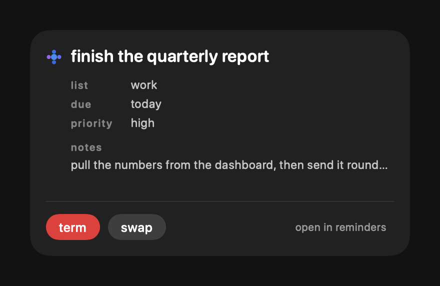
</p>

**Hold shift** and **done** becomes **term**, in red. That one completes the reminder and
then deletes it — for the things you want gone rather than filed. It has to be its own verb
rather than a checkbox on *done*, because completing a *repeating* reminder rolls it forward
to its next occurrence; removing the series is the only way to actually be rid of one. It
completes first and deletes second, so a failed delete leaves you with a finished reminder
rather than an untouched one.

There is no undo. The red is the whole warning.

When nothing is set the pill says something quiet instead — *take your time*, *no rush*, *the
day's yours*, one of fifty-five. A different register on purpose: the celebration is warm
about what you just did, these are quiet about the fact you're not doing anything. An empty
pill is not a backlog.

## the whole screen, when you want it

<p align="center">
  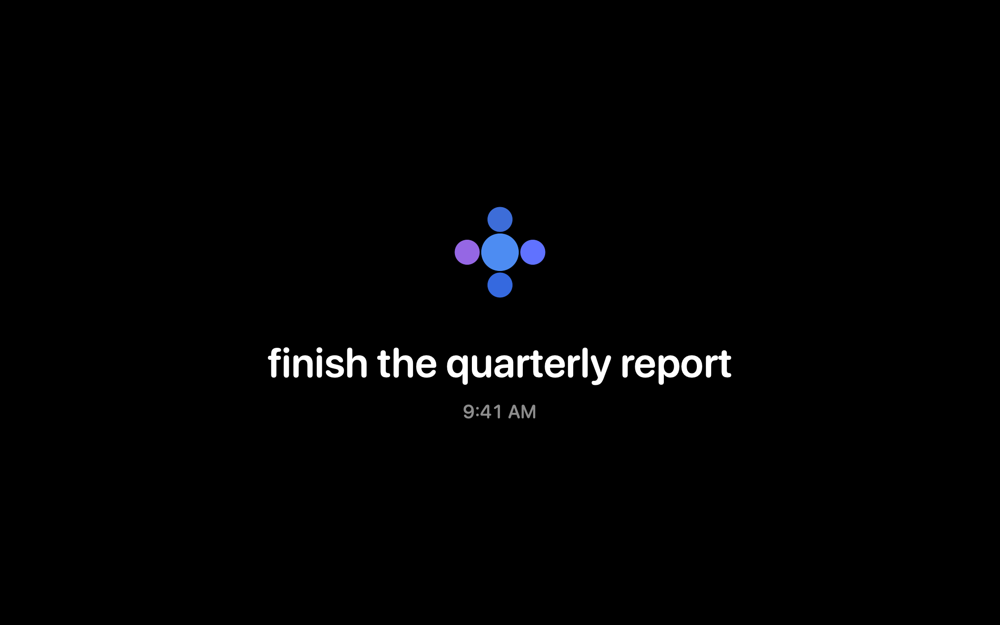
</p>

**⌘⌥⇧`** takes the flower and the title to every display at once, like a screen saver,
with the time underneath. The cursor goes away. With nothing set, the quiet phrase takes
the title's place rather than the chord appearing to do nothing.

The clock is 12- or 24-hour depending on your system setting, which it reads rather than
duplicates — there is no preference here to fall out of sync with the menu bar. Minutes,
not seconds: a second hand is movement, and the only thing meant to move is the drift.

Which is two offsets on 97 and 61 second periods, so the path wanders instead of sliding
along one line, and never visibly repeats.

Any input at all brings it back: a key, a click, a scroll, or moving the mouse more than a
few points. It ignores the first half-second, because your hand is still on the trackpad
from pressing the chord.

## settings

<p align="center">
  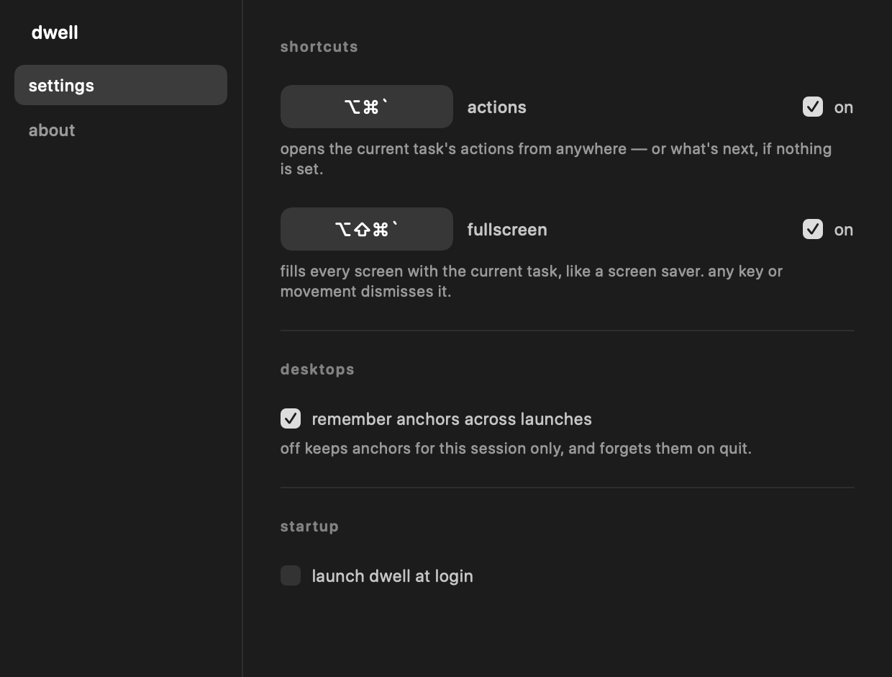
  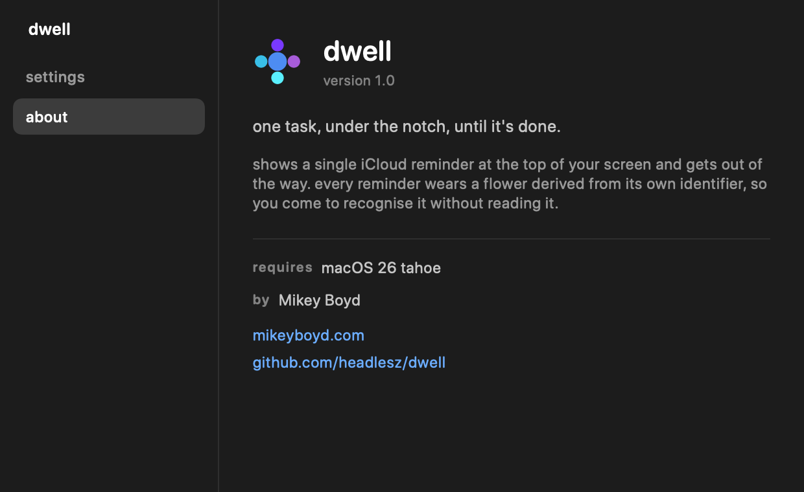
</p>

**⌘⌥`** opens the current task's actions from anywhere — or what's next, if nothing is
set. **settings…**, in the menu bar, is where both chords are rebound. That window exists
because an `NSMenu` cannot record a key chord; a window that takes keyboard focus can, so it
captures whatever you actually press — and arming one recorder disarms the other, or they
would both swallow the same keypress.

Both use Carbon's `RegisterEventHotKey` rather than global keyboard monitoring, which would
need Accessibility permission — dwell asks for nothing beyond Reminders.

## the rest of it

The pill never moves: not when an app goes fullscreen, not across Spaces, not when another
app is frontmost. It never takes focus and never intercepts a click outside its own silhouette.

**Right-click** (or two-finger click) fades it out for three seconds when it's covering
something you need to read. It restores itself.

**Keyboard**, once a panel is open:

| | |
|---|---|
| detail | `tab` reveals the cursor on **done**, so finishing is `tab` then `return` |
| detail | `shift` turns **done** into **term** — completes it, then deletes it |
| compose | `shift` turns **add** into **queue** — writes it without focusing it |
| picker | `↑`/`↓` a row · `tab` next list · `return` select |
| picker | `s` search · `f` filter · `r` new · `a` anchor · `n` nothing |
| typing | `return` ends entry and keeps the query · `esc` clears it |
| filter | `f` again turns it off — it is the only thing that does |
| either | `esc` steps back one thing at a time, and closes when there's nothing left |

**Global**: ``⌘⌥` `` opens the actions · ``⌘⌥⇧` `` goes fullscreen

[DESIGN.md](https://github.com/headlesz/dwell/blob/main/DESIGN.md) is the design philosophy
— the principles, the tensions between them, and the places the obvious implementation fails
silently.

## install

Download **[dwell.zip](../../releases/latest)** — or the copy in this repo — and unzip it.

```bash
cp -R dwell.app /Applications/
xattr -dr com.apple.quarantine /Applications/dwell.app
open /Applications/dwell.app
```

**That middle line is not optional.** This build is ad-hoc signed rather than signed with an
Apple Developer ID, so macOS quarantines it on download and refuses to open it — usually with
"dwell is damaged and can't be opened", which is not what has happened. Removing the
quarantine attribute is what lets it run. If you would rather not take a stranger's word for
any of that, the source is one repo over and `./build.sh` produces this same bundle.

Run it from `/Applications`: the path has to be stable for the Reminders permission to stick,
and `SMAppService` expects it there.

macOS asks for Reminders access on first launch. There's no dock icon and no window — dwell
lives in the pill and in a menu bar item, a small rosette in the current task's colours,
which tells you what you're **dwelling on**, completes it, offers a list to **dwell on** next,
opens settings, and quits. That menu is also the accessible path: a panel that only takes
keyboard focus while open is hard for VoiceOver to reach, so everything the pill can do, the
menu can do.

## what EventKit can't see

Subtasks, tags, flags, attachments, the URL you attach in the Reminders app, smart lists, and
the manual sort order are all invisible to EventKit. The picker's ordering is therefore
computed: soonest deadline, then priority, then title.

---

Made by [Mikey Boyd](https://mikeyboyd.com) with ❤️
